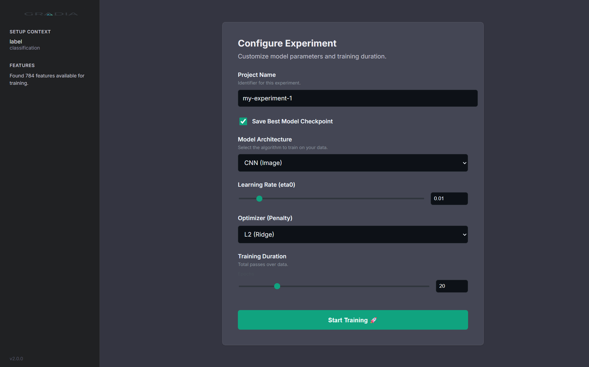
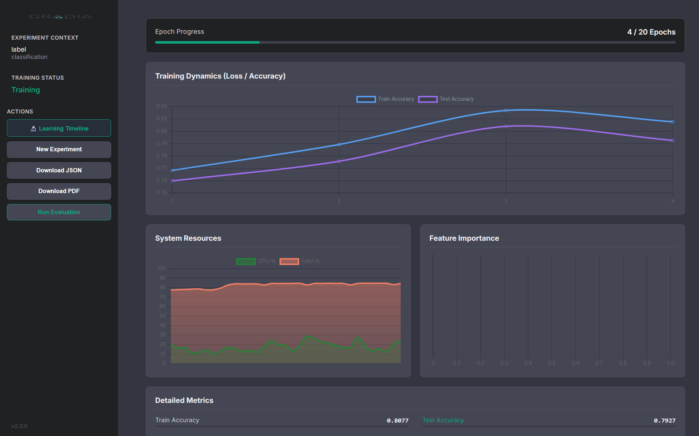

<div align="center">

# G R A D I A

**Next-Generation Local-First ML Training Visualization**

[](https://pypi.org/project/gradia/)
[](https://python.org)
[](LICENSE)
[](https://github.com/STiFLeR7/gradia/actions)

*From observing training to understanding learning.*

<p align="center">
  
</p>

</div>

---

## 🚀 What's New in v2.0.0

**Gradia v2.0.0** introduces the **Learning Timeline** — a real-time, sample-centric view of how your models learn over time. This release transforms Gradia from a metrics dashboard into a **learning behavior explorer**.

### ✨ Flagship Feature: Learning Timeline

The Learning Timeline answers questions that aggregate metrics cannot:

- 🎯 **When did this sample become correctly classified?**
- 🔄 **Which samples keep flipping predictions?**
- 📈 **Is the model memorizing or stabilizing?**
- ⚠️ **Which data points drive learning instability?**

<p align="center">
  
</p>

---

## 📖 Overview

**Gradia** is a high-performance, local-first monitoring solution for machine learning workflows. Unlike cloud-native platforms, Gradia focuses on **zero-latency**, **privacy-first** tracking that runs directly alongside your training loop.

Built on **FastAPI** and a **Reactive UI**, Gradia provides granular visibility into your model's training dynamics, system resources, and now — individual sample learning behavior.

---

## ⚡ Key Features

| Feature | Description |
| :--- | :--- |
| **🔬 Learning Timeline** | Track how individual samples evolve during training with real-time visualization |
| **📊 Real-Time Telemetry** | Nanosecond-precision tracking of Loss, Accuracy, and custom metrics |
| **🧠 Intelligent Auto-Discovery** | Automatic task type inference (Classification vs Regression) and model suggestions |
| **💻 System Profiling** | CPU and RAM monitoring during training epochs |
| **📁 Artifact Management** | Automated checkpointing and structured logging (`events.jsonl`) |
| **📋 Comprehensive Reporting** | One-click PDF/JSON reports with full training history |
| **🔄 Backward Compatible** | Full support for v1.x runs with automatic migration |

---

## 🔬 Learning Timeline Deep Dive

### How It Works

The Learning Timeline tracks a bounded subset of samples (default: 100) throughout training, capturing:

- **Prediction** — What the model predicts for each sample
- **Confidence** — Model's certainty in its prediction
- **Correctness** — Whether the prediction matches the true label
- **Flip Events** — When predictions change between epochs

### Sample Classification

Gradia automatically classifies tracked samples into categories:

| Category | Description | Visual |
| :--- | :--- | :--- |
| **Stable Correct** | Consistently correct predictions | 🟢 Green |
| **Late Learner** | Became correct after epoch N | 🟡 Yellow |
| **Unstable** | Predictions flip frequently | 🟠 Orange |
| **Persistent Error** | Never correctly classified | 🔴 Red |

### UI Blocks

The Timeline interface is organized into focused blocks:

1. **Block A: Timeline Overview** — High-level view of learning stability across all tracked samples
2. **Block B: Sample Inspector** — Deep-dive into individual sample trajectories with confidence curves
3. **Block C: Instability Panel** — Top flipping samples, late learners, and persistent errors
4. **Block D: Training Context** — Current epoch, status, and tracking metadata

---

## 🛠️ Architecture

Gradia employs a **Producer-Consumer** architecture:

```
┌─────────────────┐    ┌─────────────────┐    ┌─────────────────┐
│  Trainer Thread │───▶│   Event Queue   │───▶│   FastAPI UI    │
│   (Producer)    │    │ (Thread-Safe)   │    │   (Consumer)    │
└─────────────────┘    └─────────────────┘    └─────────────────┘
        │                                              │
        ▼                                              ▼
┌─────────────────┐                          ┌─────────────────┐
│ Sample Tracker  │                          │ Timeline Logger │
│   (v2.0 New)    │                          │   (v2.0 New)    │
└─────────────────┘                          └─────────────────┘
```

### New v2.0 Components

- **`gradia.events`** — Event model with `LearningEvent`, `SampleState`, `EpochSummary`
- **`SampleTracker`** — Boundary-aware sample selection and tracking
- **`TimelineLogger`** — Structured timeline event persistence
- **`SchemaMigrator`** — Automatic v1.x to v2.0 config migration

---

## 📦 Installation

```bash
pip install gradia --upgrade
```

### From Source

```bash
git clone https://github.com/STiFLeR7/gradia.git
cd gradia
pip install -e ".[dev]"
```

---

## 💻 Quick Start

### Basic Usage

```bash
# Auto-detect datasets and start the dashboard
gradia run .
```

### Advanced CLI

```bash
# Specify target column and port
gradia run . --target "label" --port 8080
```

### Python API

```python
from gradia.trainer.engine import Trainer
from gradia.core.scenario import ScenarioInferrer
from gradia.core.config import ConfigManager

# Infer scenario from dataset
inferrer = ScenarioInferrer()
scenario = inferrer.infer("data.csv", target_override="label")

# Configure training with timeline enabled
config_mgr = ConfigManager("./runs")
config = config_mgr.load_or_create()
config['model']['type'] = 'random_forest'
config['training']['epochs'] = 20
config['timeline']['enabled'] = True
config['timeline']['max_samples'] = 100

# Run training
trainer = Trainer(scenario, config, "./runs")
trainer.run()

# Get timeline insights
insights = trainer.get_timeline_insights()
print(f"Stable samples: {insights['stable_correct']}")
print(f"Flipping samples: {insights['top_flippers']}")
```

---

## 📊 Dashboard

Access the dashboard at `http://localhost:8000` after running `gradia run .`

### Pages

| Page | URL | Description |
| :--- | :--- | :--- |
| **Configure** | `/configure` | Select model, hyperparameters, and start training |
| **Metrics** | `/` | Real-time training metrics and system resources |
| **Timeline** | `/timeline` | Learning Timeline visualization (v2.0) |

### Configuration Options

```yaml
# Example gradia_config.yaml (auto-generated)
schema_version: "2.0"
project_name: "my-experiment"
save_model: true

model:
  type: "random_forest"
  params:
    n_estimators: 100
    max_depth: null

training:
  epochs: 20
  test_split: 0.2
  random_seed: 42

timeline:
  enabled: true
  max_samples: 100
  sampling_strategy: "boundary"
```

---

## 🔄 Migration from v1.x

Gradia v2.0 is **fully backward compatible**. When you run `gradia run .` on a v1.x project:

1. Existing configs are automatically migrated to v2.0 schema
2. Old runs remain accessible
3. Timeline features are enabled by default

```bash
# Migration happens automatically
gradia run .
# Output: Config migrated: Added timeline config, Set schema_version to 2.0
```

---

## 🧪 Testing

```bash
# Run all tests
pytest tests/ -v

# Run with coverage
pytest tests/ --cov=gradia --cov-report=html
```

---

## 📁 Project Structure

```
gradia/
├── cli/              # Typer CLI application
├── core/             # Configuration, inspection, migration
├── events/           # v2.0 Event model and tracking
│   ├── models.py     # LearningEvent, SampleState, EpochSummary
│   ├── tracker.py    # SampleTracker with boundary sampling
│   └── logger.py     # TimelineLogger for event persistence
├── models/           # sklearn wrappers and model factory
├── trainer/          # Training engine with timeline integration
└── viz/              # FastAPI server and UI templates
    ├── templates/    # Jinja2 HTML templates
    └── static/       # CSS and JavaScript
```

---

## 🗺️ Roadmap

### v2.1 (Planned)
- [ ] WebSocket real-time updates
- [ ] Dataset Intelligence Panel
- [ ] Experiment Comparison (overlay 2-3 runs)
- [ ] Export timeline to video/GIF

### v2.2 (Future)
- [ ] PyTorch integration
- [ ] TensorFlow/Keras support
- [ ] Remote monitoring mode

---

## 🤝 Contributing

We welcome contributions! Please see [CONTRIBUTING.md](CONTRIBUTING.md) for guidelines.

```bash
# Development setup
git clone https://github.com/STiFLeR7/gradia.git
cd gradia
pip install -e ".[dev]"

# Run tests
pytest tests/ -v

# Lint
flake8 gradia/
```

---

## 📄 License

Distributed under the MIT License. See [LICENSE](LICENSE) for more information.

---

## 🔗 Links

- **PyPI**: [pypi.org/project/gradia](https://pypi.org/project/gradia/)
- **GitHub**: [github.com/STiFLeR7/gradia](https://github.com/STiFLeR7/gradia)
- **Hugging Face**: [huggingface.co/STiFLeR7](https://huggingface.co/STiFLeR7)
- **Issues**: [github.com/STiFLeR7/gradia/issues](https://github.com/STiFLeR7/gradia/issues)

---

<div align="center">
  <sub>Built with ❤️ by <strong>STiFLeR</strong> for the ML Community.</sub>
  <br><br>
  <a href="https://instagram.com/stifler.xd">Instagram</a> •
  <a href="https://huggingface.co/STiFLeR7">Hugging Face</a> •
  <a href="https://pypi.org/user/stifler.xd/">PyPI</a>
</div>
